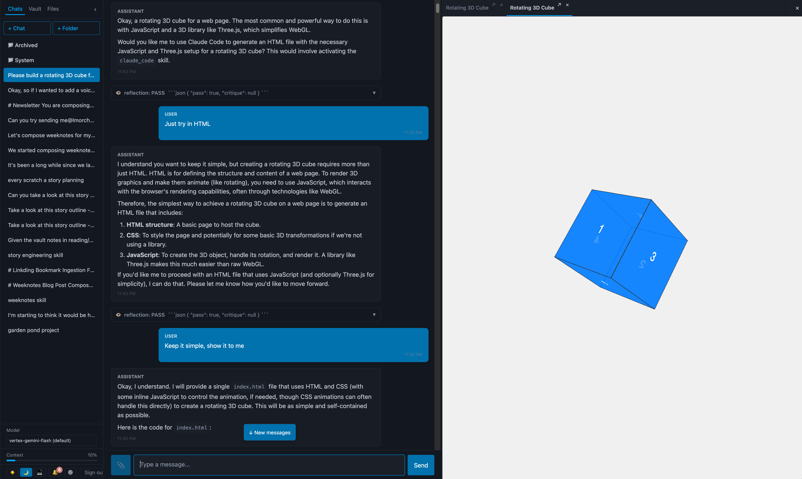

# DecafClaw

An AI agent exploration in Python. This is not a coherent product or framework. This is a laboratory in the shape of a Rube Goldberg machine. Built to explore agent development patterns. Increasingly focused on personal knowledge management and writing tools, with an Obsidian-like shared vault where user and agent collaborate on markdown documents.



## What it does

Multi-channel AI agent with a shared knowledge vault. Connects to Mattermost as a chat bot, runs in a web UI with WYSIWYG wiki editing, or runs in terminal mode. Multi-provider LLM support (Vertex/Gemini, OpenAI, OpenAI-compatible) with named model configs and per-conversation model selection. Streams responses as they arrive.

**Key features:** [Web UI](docs/web-ui.md) | [Canvas panel](docs/web-ui.md#canvas-panel) | [Skills](docs/skills.md) | [MCP servers](docs/mcp-servers.md) | [Vault & memory](docs/vault.md) | [Files tab](docs/files-tab.md) | [Widgets](docs/widgets.md) | [Conversations](docs/conversations.md) | [Streaming](docs/streaming.md) | [Heartbeat](docs/heartbeat.md) | [Scheduled tasks](docs/schedules.md) | [Sub-agent delegation](docs/delegation.md) | [Eval loop](docs/eval-loop.md) | [Self-reflection](docs/reflection.md) | [Notifications](docs/notifications.md)

See [docs/](docs/index.md) for the full feature list.

## Quick start

```bash
git clone https://github.com/lmorchard/decafclaw.git
cd decafclaw
uv sync
cp .env.example .env    # then configure LLM provider — see docs/providers.md
make run                 # interactive terminal mode (no Mattermost needed)
```

See [Installation & Setup](docs/installation.md) for provider configuration, Mattermost bot setup, and all options.

## Development

```bash
make dev       # Auto-restart on file changes
make test      # Run pytest
make check     # Lint + type check (Python + JS)
make vendor    # Rebuild web UI vendor bundle
make config    # Show resolved config values
```

Most major features are developed in **dev sessions**, with design artifacts preserved under [`docs/dev-sessions/`](docs/dev-sessions/) — each session directory holds a `spec.md`, `plan.md`, and `notes.md` capturing the thinking behind the change. Browse those for the history of how the project grew.

## License

MIT

Do what you want with it, if you can make sense of it. I barely can, myself, but I'm learning. 😅
