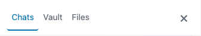
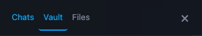
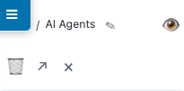
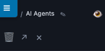

# Web UI design system

Shared visual-layer vocabulary for the DecafClaw web UI. See [web-ui.md](web-ui.md) for component architecture and feature surface; this doc covers styling primitives and Pico-in-context conventions.

The point of this doc is to short-circuit the "make this match X" guessing game. Future styling asks should read as *"match the floating-control primitive"* or *"this is an icon-button with the accent-hover variant"*, not *"copy what the hamburger does."* If a request can't be expressed in this vocabulary, that's the signal to extend the vocabulary, not to write another one-off.

The web UI loads [Pico v2](https://picocss.com/) (vendored at `src/decafclaw/web/static/vendor/bundle/pico.min.css`) as its base layer, then layers our custom rules on top. Most of the surprising behavior in our styles comes from how Pico re-scopes its own variables inside specific contexts (notably `<button>`), so the **Pico-in-context** section is the load-bearing read.

---

## Pico-in-context

### Stable Pico variables we use

These resolve to predictable values in both themes and don't get re-scoped in any context that bites our component code:

- `--pico-muted-color` — secondary/dim text (e.g. button rest state for icon controls)
- `--pico-color` — document text color
- `--pico-primary` — brand primary (used for accent hovers and active states)
- `--pico-muted-border-color` — neutral 1px borders
- `--pico-card-background-color`, `--pico-form-element-background-color` — non-aliased card-shaped backgrounds
- `--pico-code-background-color`, `--pico-mark-background-color` — subtle inline backgrounds
- `--pico-del-color`, `--pico-ins-color` — destructive / affirmative semantic colors

### Variables Pico re-scopes inside `<button>` (the trap)

Pico v2 re-aliases two CSS custom properties when the cascade enters a `<button>` (or `[role="button"]`) context:

- `--pico-color` → `--pico-primary-inverse` (white in both themes)
- `--pico-background-color` → `--pico-primary-background` (brand blue)

So `.my-btn { background: var(--pico-background-color); color: var(--pico-color); }` resolves to **white text on brand blue inside a button**, NOT "document bg / document text" as the names suggest.

**Escape hatches:**
- Use `color: inherit` to break out of the button-scoped alias and inherit the document text color from the parent.
- Use a non-aliased var: `--pico-card-background-color`, `--pico-form-element-background-color`, `--pico-card-sectioning-background-color` are NOT re-scoped.
- For solid primary look, just don't set bg/color — Pico's defaults already handle it.

### `--pico-secondary-background` is a TEXT color, not a background

Resolves to `#525f7a` (dark blue-gray) in both themes. Used by Pico as a button text color. **Don't reach for it as a panel/strip background** — it bit us in PR #408 (canvas tab strip turned dark in light mode).

### Variables we deliberately don't touch

- `--pico-primary-inverse`, `--pico-primary-background` — Pico owns the filled-primary look entirely; let it.
- `--pico-secondary-hover-background` — used for our `.conv-item:hover` and similar; predictable, but interacts oddly with `<button>` contexts. Test if you reuse it elsewhere.
- Pico's typography vars (`--pico-font-family`, `--pico-line-height`) — we inherit these globally; overriding locally creates drift.

---

## Component primitives

The four shared classes live in `src/decafclaw/web/static/styles/primitives.css`, loaded as the second `@import` in `style.css` so primitive rules sit deliberately upstream of any per-component override.

### `.dc-floating-btn`

 

Border + 6px radius + drop shadow + 44px tap-target floor. Defined at `primitives.css`.

**What it is:** the look for any free-floating control that should read as "tappable, lifted off the page" — hamburger menu, canvas resummon pill, mobile disclosure triangle, scroll-to-bottom pill. Provides structural shape; bg / text color / horizontal padding are set by each consumer.

**What it isn't:** in-flow buttons (use Pico defaults), action buttons inside a header row (use `.dc-icon-btn`), filled-primary CTAs (Pico's `<button>` defaults already cover this).

**Used by:**
- `index.html:29` — hamburger (mobile)
- `app.js:701` — canvas resummon pill
- `chat-view.js:185` — scroll-to-bottom pill
- `canvas-panel.js:208` — canvas mobile disclosure

**Don't:** redeclare `border`, `border-radius`, `box-shadow`, `min-width`, or `min-height` on a button using this class. The primitive owns those — overriding them locally is the cluster-style fragility this doc exists to prevent.

### `.dc-overlay-header`

 

Mobile-only flex header row (57px min-height, bottom border, 0.4rem 0.75rem padding). Defined at `primitives.css`.

**What it is:** the strip across the top of a mobile overlay panel where the close-X lives — the left sidebar's mobile header and the canvas panel's mobile header use it. Fixed min-height keeps the close-X centered at the same Y on both panels and matches the fixed hamburger's tap-target span.

**What it isn't:** desktop headers (the rule is wrapped in `@media (max-width: 639px)`), in-content section headings (use `<h2>` or `.config-panel-header`-style per-component classes).

**Used by:**
- `conversation-sidebar.js:466` — left sidebar mobile header
- `canvas-panel.js:207` — canvas panel mobile header

**Don't:** apply this class outside a mobile overlay. The desktop side has no equivalent because desktop headers don't share a unifying shape (sidebar vs canvas vs config all differ on purpose).

### `.dc-overlay-close-x`

 

The close-X glyph on overlay headers. 1.5rem font, muted → document-color hover, no border, no bg. Tag-qualified as `button.dc-overlay-close-x` so Pico's button rules don't override the muted color. Defined at `primitives.css`.

**What it is:** the dismiss button at the right edge of a mobile overlay header. Bigger than the action-cluster icon buttons (1.5rem vs 1rem) because it's the primary tap target for closing.

**What it isn't:** any in-flow close button (use `.dc-icon-btn`), the inspector close (also `.dc-icon-btn` — that's a small popover, not an overlay).

**Used by:**
- `conversation-sidebar.js:475` — sidebar mobile close
- `canvas-panel.js:214` — canvas panel mobile close

### `.dc-icon-btn`

 

Borderless, transparent-bg, muted-color icon button. Tag-qualified for both `<button>` and `<a>` so Pico's button rules don't override the muted color, and so link-styled action triggers (e.g. "open in new tab") participate in the primitive. Defined at `primitives.css`.

**What it is:** the lightweight icon control that appears in headers and breadcrumbs across the app. Default `:hover` color is `--pico-color` ("quiet de-mute" — the button surfaces but doesn't shout). Sites that want a more emphatic hover override `:hover color` to `--pico-primary` ("accent lift") via their per-component class — that's deliberate and documented as the two flavors of the primitive.

**What it isn't:** floating controls (use `.dc-floating-btn`), toggle buttons with active states (use a per-component class — see "Not-quite primitives" below), text-style buttons in the chat input (those have their own opacity-based pattern).

**Used by — quiet flavor (hover → `--pico-color`):**
- `config-panel.js:89,112` — config back / close
- `conversation-sidebar.js:460,476` — sidebar collapse (collapsed and expanded states)
- `context-inspector.js:265` — inspector close

**Used by — accent flavor (hover → `--pico-primary`, override in per-component CSS):**
- `wiki-page.js:247` — wiki close
- `wiki-page.js:250` — wiki edit / view toggle
- `wiki-page.js:251` — wiki delete
- `wiki-page.js:252` — wiki open in new tab (the `<a>` case)
- `wiki-page.js:285` — wiki rename (smaller font)
- `file-page.js:358,368,373,378` — file rename / edit / delete / close

**Don't:** redeclare `background`, `border`, `color`, `padding`, `margin`, `line-height`, or `cursor` on a button using this class. Per-site CSS should only override font-size, padding (if intentionally tighter), `margin-left` for action clusters, and `:hover color` for the accent flavor.

**Tag-qualify ALL per-component overrides on `.dc-icon-btn` consumers** (`button.foo` not `.foo`, `a.foo` not `.foo`) — not just hover. Both the primitive's resting selector (`button.dc-icon-btn, a.dc-icon-btn`, specificity 0,1,1) and its hover selector (`button.dc-icon-btn:hover, a.dc-icon-btn:hover`, 0,2,1) outrank a bare `.foo` (0,1,0) or `.foo:hover` (0,2,0) by one tag-selector point. A bare-class per-site override silently loses, and the primitive's `padding` / `margin` / `color` / `:hover color` win — usually invisibly. Tag-qualifying the override (e.g. `button.wiki-edit-btn`, `a.wiki-open-tab`) ties the primitive's specificity; source-order then wins for the override since per-component CSS loads after `primitives.css`.

This is exactly the rule from cascade-rule §1 (tag-qualify custom button rules). It applies twice over for `.dc-icon-btn` consumers — once to beat Pico's `button:not(...)` rule, once to override the primitive itself.

### Not-quite primitives (deliberately kept per-component)

These look superficially similar to icon buttons but follow different visual patterns; they're NOT migrated into `.dc-icon-btn`. Coining a "toggle button" primitive in the future would absorb these:

- **`.theme-btn`** (`sidebar.css:244–263`) — has a 1px border, hover changes background (not color), and an active state with brand-primary fill. Toggle button pattern.
- **`.wiki-editor-toolbar-btn`** (`wiki-editor.css:70–88`) — transparent border for layout reservation, hover changes background, has an active state. Toolbar button pattern.
- **`.conv-archive`** (`sidebar.css:69–88`) — opacity-based hover (`0.5 → 1`), not color-based. Hover-revealed secondary action pattern.
- **`.archived-toggle`** (`sidebar.css:94–105`) — text label with a top border; layout-shaped, not button-shaped.
- **`.copy-btn`** (`chat.css`), **`.attach-btn`** (`chat-input.css`), **`.stop-btn`** (`chat-input.css`) — chat-input controls with their own opacity- and semantic-color patterns.

When a fifth or sixth surface joins one of these patterns, that's the signal to coin a new primitive (see "Token vocabulary" rules below).

---

## Cascade rules of engagement

Six rules, each with the specific incident or Pico behavior that necessitates it. Knowing *why* lets you judge edge cases instead of mechanically applying.

### 1. Tag-qualify custom button rules (`button.foo`, not `.foo`)

*Why:* Pico's `button:not([type=submit]):not(...)` selector is specificity 0,1,1; bare `.foo` (0,1,0) silently loses regardless of load order. `button.foo` is 0,1,1 and ties Pico, then wins by source order. The `.dc-overlay-close-x` and `.dc-icon-btn` primitives both use this — that's why their selectors lead with `button.` (and `a.` for `.dc-icon-btn`).

### 2. `box-sizing: border-box` on tap-target floors

*Why:* Pico sets `*, *::before, *::after { box-sizing: border-box }` globally, but a custom rule that uses content-box (or where padding pushes content past min-height) yields buttons taller than 44px. `.dc-floating-btn` and `.dc-overlay-header` both set `box-sizing: border-box` explicitly so 44px / 57px floors are exact regardless of border + padding.

### 3. Explicit `display:` inside `@media` blocks for mobile-only elements

*Why:* `.hamburger-btn` and `.canvas-mobile-disclosure` have `display: none` defaults outside the mobile media query and rely on the mobile rule to set `display: <value>`. If you refactor the mobile rule's `display` into a shared class outside the `@media`, the desktop default wins and the element disappears at all sizes. **Always keep an explicit `display: <value>` in the mobile rule** even when it duplicates a primitive's default.

### 4. Primitives load before components in `style.css`

*Why:* `style.css` imports `variables.css` then `primitives.css` then all per-component stylesheets. Source-order tiebreaker matters when component classes (0,1,0) override primitive classes (0,1,1) at intentionally different rules. Putting primitives second in the chain means component overrides win when they want to and lose when they don't — predictable.

### 5. `--pico-secondary-background` is a TEXT color, not a background

*Why:* Resolves to `#525f7a` (dark blue-gray). The name reads like "use this for secondary surfaces" — it isn't. In PR #408 a "secondary tab strip" rule using this var rendered as a near-black panel in light mode. Use `--pico-card-background-color` or `--pico-form-element-background-color` for non-aliased background surfaces.

### 6. Inside a `<button>`, `--pico-color` and `--pico-background-color` are re-scoped

*Why:* Pico v2 re-aliases these two CSS custom properties when the cascade enters a `<button>` context — see Pico-in-context section above. The names are misleading inside button scope. If you find yourself wanting "document text on document bg" inside a button, use `color: inherit` or a non-aliased var.

---

## Token vocabulary

These are the magic numbers blessed for the design layer. Anything outside this list is a signal we need a new token, not another one-off.

| Token | Value | Used by |
|---|---|---|
| Tap-target floor | 44px | `.dc-floating-btn`, mobile button `min-height` rule |
| Floating-btn radius | 6px | `.dc-floating-btn` |
| Drop shadow | `0 2px 8px rgba(0,0,0,0.25)` | `.dc-floating-btn` |
| Overlay-header min-height | 57px | `.dc-overlay-header` |
| Overlay-header padding | `0.4rem 0.75rem` | `.dc-overlay-header` |
| Close-X font-size | 1.5rem | `.dc-overlay-close-x` |
| Close-X padding | `0.4rem 0.6rem` | `.dc-overlay-close-x` |
| Icon-btn padding (default) | `0.25rem 0.5rem` | `.dc-icon-btn` (override per-site if intentionally tighter) |
| Icon-btn font-size (default) | inherits parent | `.dc-icon-btn` (overrides: 1rem for action buttons, 1.2rem for close, 0.75rem for rename) |

If you find yourself reaching for a number that isn't in this table, you're either:
- Picking a deliberate exception (document it in the per-component CSS comment), or
- Identifying a gap in the design system (raise it; we'll add a token).

---

## See also

- [Web UI architecture](web-ui.md) — component layout, transport, REST API
- [Web UI mobile](web-ui-mobile.md) — viewport handling, tap targets, soft keyboard
- `CLAUDE.md` § Web UI styling — the most-bitten gotchas inline
- `src/decafclaw/web/static/styles/primitives.css` — canonical primitive definitions
